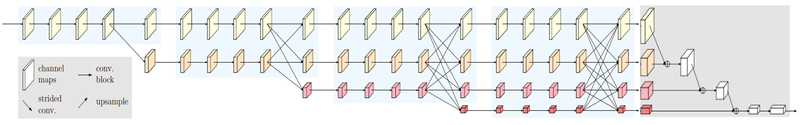

# High-resolution networks (HRNets) for Image classification

## News

- [2021/01/20] Add some stronger ImageNet pretrained models, e.g., the HRNet_W48_C_ssld_pretrained.pth achieved top-1 acc 83.6%.

- [2020/03/13] Our paper is accepted by TPAMI: [Deep High-Resolution Representation Learning for Visual Recognition](https://arxiv.org/pdf/1908.07919.pdf).

- Per request, we provide two small HRNet models. #parameters and GFLOPs are similar to ResNet18. The segmentation resutls using the two small models are also available at https://github.com/HRNet/HRNet-Semantic-Segmentation.

- TensoFlow implemenation available at https://github.com/yuanyuanli85/tf-hrnet. Thanks [VictorLi](https://github.com/yuanyuanli85)!

- ONNX export enabled after fixing issues. Thanks [Baowen Bao](https://github.com/BowenBao)!

## Introduction
This is the official code of [high-resolution representations for ImageNet classification](https://arxiv.org/abs/1904.04514). 
We augment the HRNet with a classification head shown in the figure below. First, the four-resolution feature maps are fed into a bottleneck and the number of output channels are increased to 128, 256, 512, and 1024, respectively. Then, we downsample the high-resolution representations by a 2-strided 3x3 convolution outputting 256 channels and add them to the representations of the second-high-resolution representations. This process is repeated two times to get 1024 channels over the small resolution. Last, we transform 1024 channels to 2048 channels through a 1x1 convolution, followed by a global average pooling operation. The output 2048-dimensional representation is fed into the classifier.



## ImageNet pretrained models
HRNetV2 ImageNet pretrained models are now available!

| model |#Params | GFLOPs |top-1 error| top-5 error| Link |
| :--: | :--: | :--: | :--: | :--: | :--: |
| HRNet-W18-C-Small-v1 | 13.2M | 1.49 | 27.7% | 9.3% |[OneDrive](https://1drv.ms/u/s!Aus8VCZ_C_33gRv2PI1vjJyn2g7G?e=i8Rdzx)/[BaiduYun(Access Code:v3sw)](https://pan.baidu.com/s/1snP_gTz50pJp2g07anVIEA)
| HRNet-W18-C-Small-v2 | 15.6M | 2.42 | 24.9% | 7.6% |[OneDrive](https://1drv.ms/u/s!Aus8VCZ_C_33gRmfdPR79WBS61Qn?e=HVZUi8)/[BaiduYun(Access Code:bnc9)](https://pan.baidu.com/s/1tbL45sOS4mXNGgyS4YCQww)
| HRNet-W18-C | 21.3M | 3.99 | 23.2% | 6.6% |[OneDrive](https://1drv.ms/u/s!Aus8VCZ_C_33cMkPimlmClRvmpw)/[BaiduYun(Access Code:r5xn)](https://pan.baidu.com/s/1Px_g1E2BLVRkKC5t-b-R5Q)|
| HRNet-W30-C | 37.7M | 7.55 | 21.8% | 5.8% |[OneDrive](https://1drv.ms/u/s!Aus8VCZ_C_33cQoACCEfrzcSaVI)/[BaiduYun(Access Code:ajc1)](https://pan.baidu.com/s/1yEz7hKaJT-H7eHLteAotbQ)|
| HRNet-W32-C | 41.2M | 8.31 | 21.5% | 5.8% |[OneDrive](https://1drv.ms/u/s!Aus8VCZ_C_33dYBMemi9xOUFR0w)/[BaiduYun(Access Code:itc1)](https://pan.baidu.com/s/1xn92PSCg5KtXkKcnnLOycw)||
| HRNet-W40-C | 57.6M | 11.8 | 21.1% | 5.5% |[OneDrive](https://1drv.ms/u/s!Aus8VCZ_C_33ck0gvo5jfoWBOPo)/[BaiduYun(Access Code:i58x)](https://pan.baidu.com/s/1DD3WKxgLM1jawR87WdAtsw)|
| HRNet-W44-C | 67.1M | 13.9 | 21.1% | 5.6% |[OneDrive](https://1drv.ms/u/s!Aus8VCZ_C_33czZQ0woUb980gRs)/[BaiduYun(Access Code:3imd)](https://pan.baidu.com/s/1F679dvz9iJ8aFAp6YKr9Rw)|
| HRNet-W48-C | 77.5M | 16.1 | 20.7% | 5.5% |[OneDrive](https://1drv.ms/u/s!Aus8VCZ_C_33dKvqI6pBZlifgJk)/[BaiduYun(Access Code:68g2)](https://pan.baidu.com/s/13b8srQn8ARF9zHsaxvpRWA)|
| HRNet-W64-C | 128.1M | 26.9 | 20.5% | 5.4% |[OneDrive](https://1drv.ms/u/s!Aus8VCZ_C_33gQbJsUPTIj3rQu99)/[BaiduYun(Access Code:6kw4)](https://pan.baidu.com/s/16ycW99VAYat3fHjgKpUXvQ)|

Newly added checkpoints:

| model |#Params | GFLOPs |top-1 error |  Link |
| :--: | :--: | :--: | :--: | :--: |
| HRNet-W18-C (w/ CosineLR + CutMix + 300epochs) | 21.3M | 3.99 | 22.1%  | [Link](https://github.com/HRNet/HRNet-Image-Classification/releases/download/PretrainedWeights/HRNet_W18_C_cosinelr_cutmix_300epoch.pth.tar)
| HRNet-W48-C (w/ CosineLR + CutMix + 300epochs) | 77.5M | 16.1 | 18.9%  | [Link](https://github.com/HRNet/HRNet-Image-Classification/releases/download/PretrainedWeights/HRNet_W48_C_cosinelr_cutmix_300epoch.pth.tar)
| HRNet-W18-C-ssld (converted from PaddlePaddle) | 21.3M | 3.99 | 18.8%  | [Link](https://github.com/HRNet/HRNet-Image-Classification/releases/download/PretrainedWeights/HRNet_W18_C_ssld_pretrained.pth)
| HRNet-W48-C-ssld (converted from PaddlePaddle) | 77.5M | 16.1 | 16.4%  | [Link](https://github.com/HRNet/HRNet-Image-Classification/releases/download/PretrainedWeights/HRNet_W48_C_ssld_pretrained.pth)

In the above Table, the first 2 checkpoints are trained with CosineLR, CutMix data augmentation and for longer epochs, i.e., 300epochs. The other two checkpoints are converted
from [PaddleClas](https://github.com/PaddlePaddle/PaddleClas). Please refer to [SSLD tutorial](https://github.com/PaddlePaddle/PaddleClas/blob/dygraph/docs/en/advanced_tutorials/distillation/distillation_en.md#ssld) for more details.

## Quick start
### Install
1. Install PyTorch=0.4.1 following the [official instructions](https://pytorch.org/)
2. git clone https://github.com/HRNet/HRNet-Image-Classification
3. Install dependencies: pip install -r requirements.txt

### Data preparation
You can follow the Pytorch implementation:
https://github.com/pytorch/examples/tree/master/imagenet

The data should be under ./data/imagenet/images/.

### Train and test
Please specify the configuration file.

For example, train the HRNet-W18 on ImageNet with a batch size of 128 on 4 GPUs:
````bash
python tools/train.py --cfg experiments/cls_hrnet_w18_sgd_lr5e-2_wd1e-4_bs32_x100.yaml
````

For example, test the HRNet-W18 on ImageNet on 4 GPUs:
````bash
python tools/valid.py --cfg experiments/cls_hrnet_w18_sgd_lr5e-2_wd1e-4_bs32_x100.yaml --testModel hrnetv2_w18_imagenet_pretrained.pth
````

## Other applications of HRNet
* [Human pose estimation](https://github.com/leoxiaobin/deep-high-resolution-net.pytorch)
* [Semantic segmentation](https://github.com/HRNet/HRNet-Semantic-Segmentation)
* [Object detection](https://github.com/HRNet/HRNet-Object-Detection)
* [Facial landmark detection](https://github.com/HRNet/HRNet-Facial-Landmark-Detection)

## Citation
If you find this work or code is helpful in your research, please cite:
````
@inproceedings{SunXLW19,
  title={Deep High-Resolution Representation Learning for Human Pose Estimation},
  author={Ke Sun and Bin Xiao and Dong Liu and Jingdong Wang},
  booktitle={CVPR},
  year={2019}
}

@article{WangSCJDZLMTWLX19,
  title={Deep High-Resolution Representation Learning for Visual Recognition},
  author={Jingdong Wang and Ke Sun and Tianheng Cheng and 
          Borui Jiang and Chaorui Deng and Yang Zhao and Dong Liu and Yadong Mu and 
          Mingkui Tan and Xinggang Wang and Wenyu Liu and Bin Xiao},
  journal   = {TPAMI}
  year={2019}
}
````

## Reference
[1] Deep High-Resolution Representation Learning for Visual Recognition. Jingdong Wang, Ke Sun, Tianheng Cheng, 
    Borui Jiang, Chaorui Deng, Yang Zhao, Dong Liu, Yadong Mu, Mingkui Tan, Xinggang Wang, Wenyu Liu, Bin Xiao. Accepted by TPAMI.  [download](https://arxiv.org/pdf/1908.07919.pdf)
